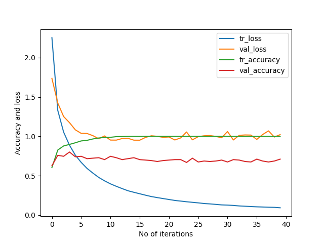

# DrivingDirection-80.1-Participant-10
Epoch 40: val_accuracy did not improve from 0.80120  
54/54 [==============================] - 1s 13ms/step - loss: 0.0929 - accuracy: 1.0000 - val_loss: 1.0223 - val_accuracy: 0.7108  
[[66  9 11]    
 [11 21  1]    
 [15  1 31]]    
54/54 [==============================] - 0s 4ms/step - loss: 0.8076 - accuracy: 0.9123   
6/6 [==============================] - 0s 3ms/step - loss: 1.1749 - accuracy: 0.8012     
Train: 0.912, Test: 0.801    
[[64  9 13]                   
 [ 2 30  1]                  
 [ 7  1 39]]                 

